# AIMS Agriventure, Inc. OPEEPS
AIMS Agriventure, Inc. Online Performance Evaluating & Employee Profiling System.

## Future Updates
* Add Button to add Employment Position
* Add DateHired Computation to tell the years, months, and days from the datehired upto the current date.
* Add Backup Record

## Home Page
1. [Portal](#portal)

## Admin Page
### View List
*  [List of Employees](#list-of-employees)
    1. Add Employee Account
    2. [Edit Employee Account](#edit-employee-account)
    3. [Evaluate Employee](#evaluate-employee)
        1. Evaluation History
        2. Evaluate
    4. [Attachments](#attachments)
        1. Download
        2. Preview
    5. [Delete Employee](#delete-employee)
* List of Applicants
    1. [View Examination](#view-examination)
        1. Print
    2. [Approve](#approve)
    3. [Decline](#decline)

### Examination Codes
1. [Generate New Code](#generate-code)

## Employee Page
1. [Upload Scanned Image](#upload-scanned-image)
2. [Upload Profile Picture](#upload-profile-picture)
3. [Delete Image, Download Image](#images)

## Screenshots
### Portal
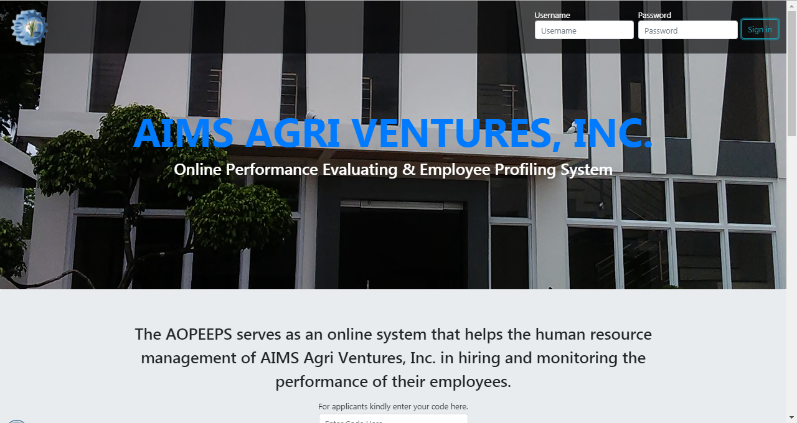
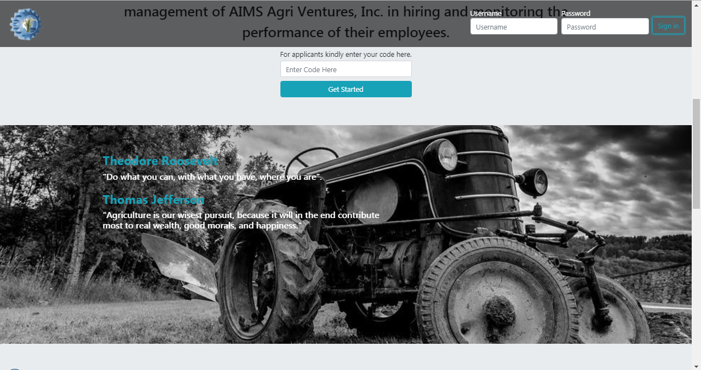

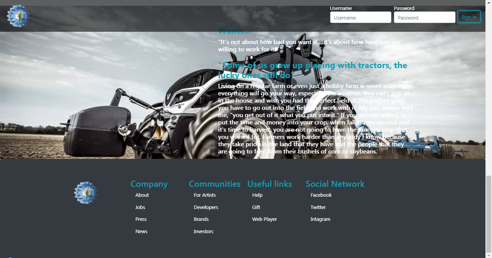

### List of Employees:
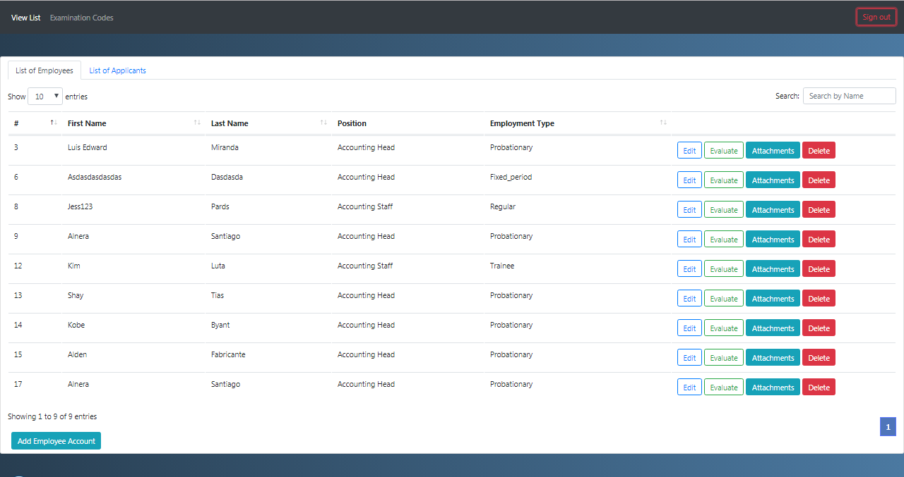
#### Add Employee Account

#### Edit Employee Account

#### Evaluate Employee
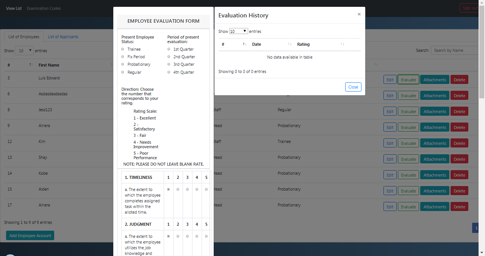
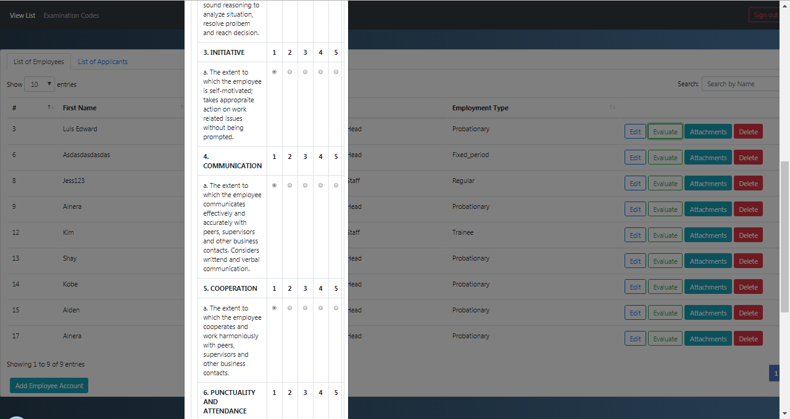
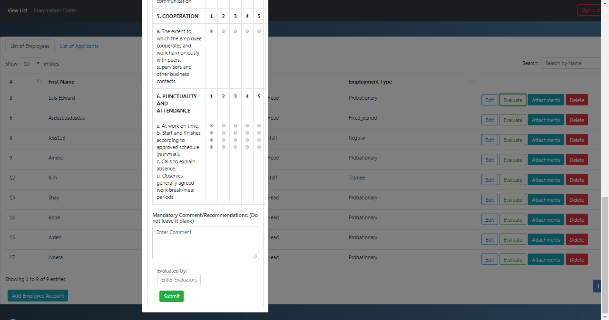
#### Attachments
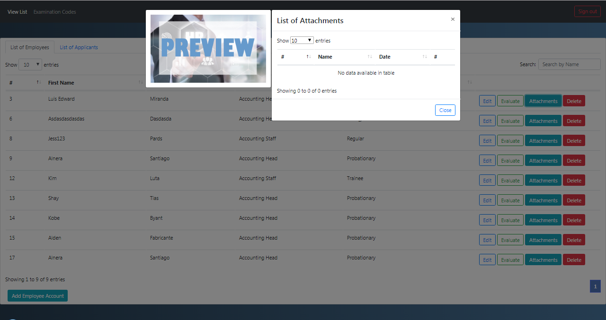
#### Delete Employee

### List of Applicants
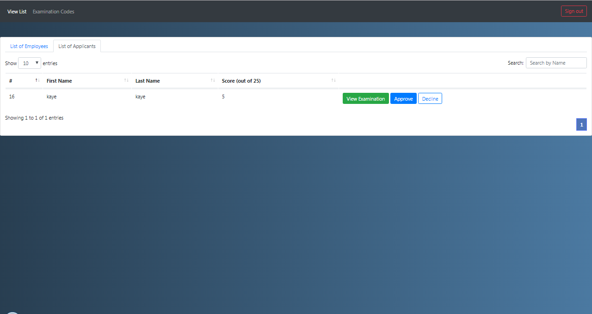
#### View Examination
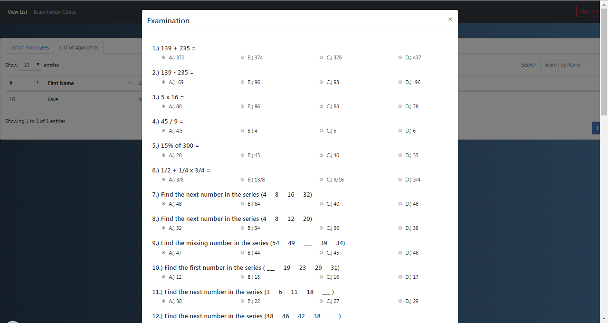
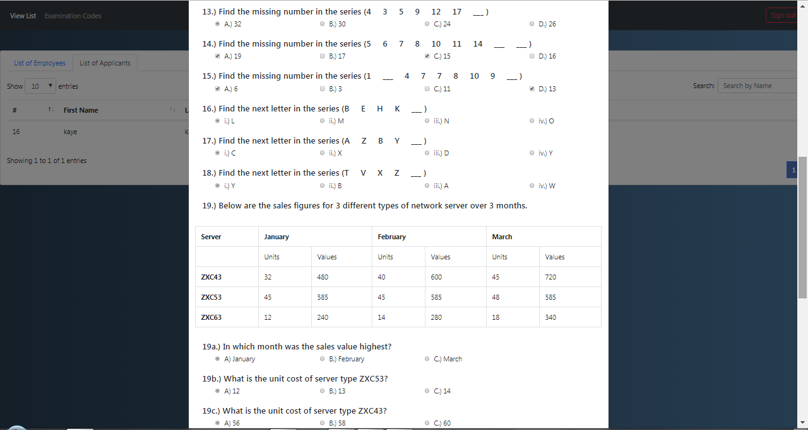
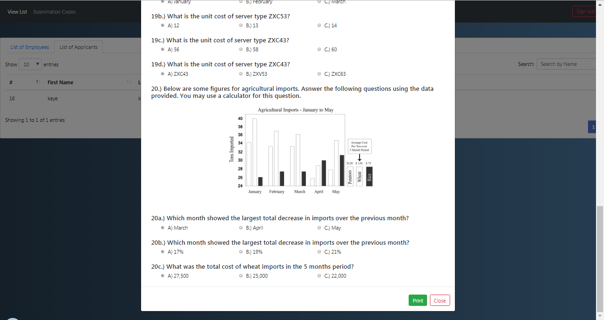
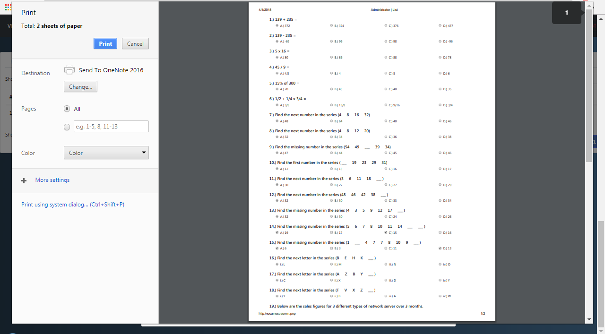
#### Approve

#### Decline

### Generate Code
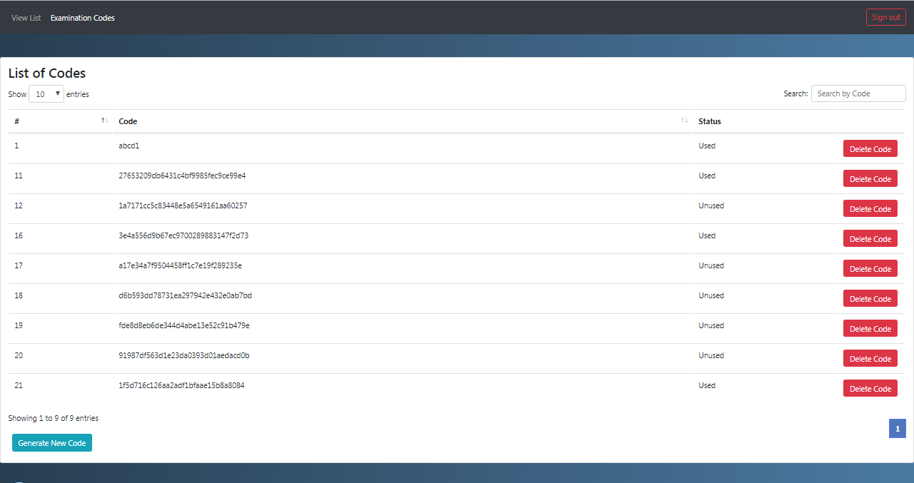

### Upload Scanned Image

### Upload Profile Picture

### Images
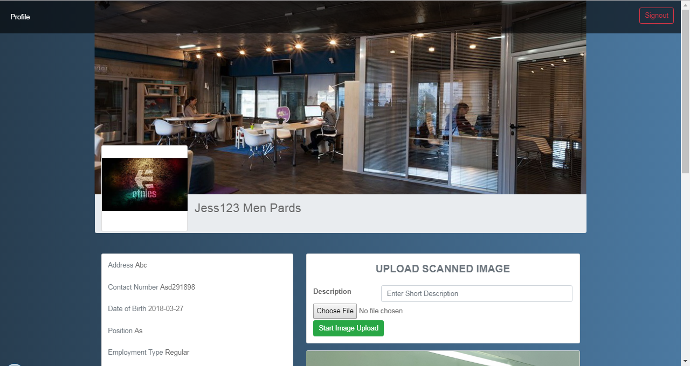
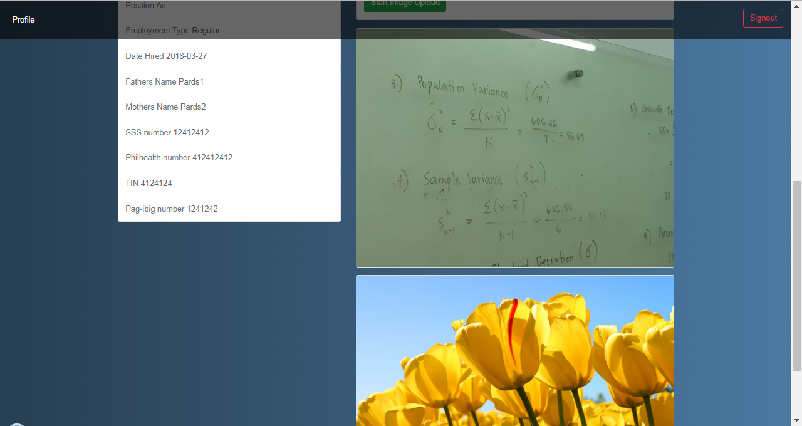
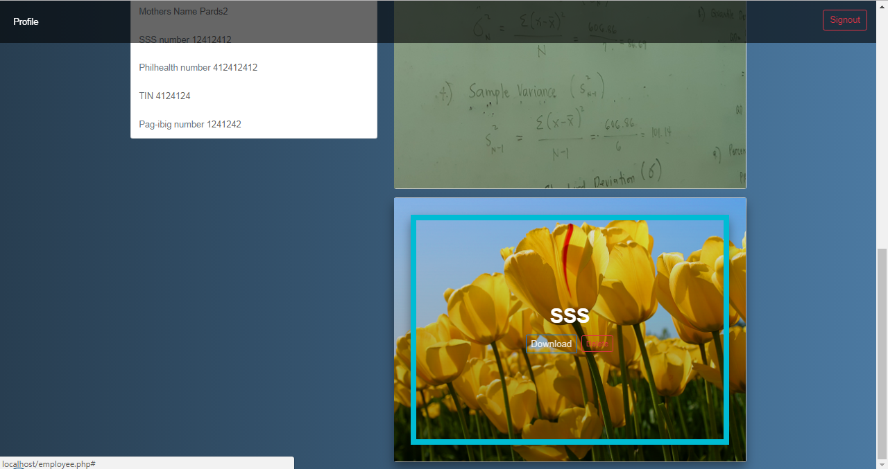

